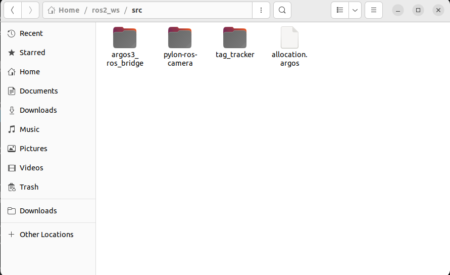
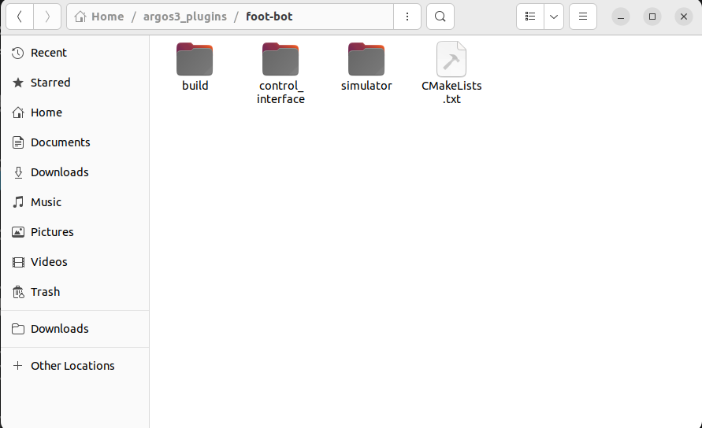

# Thymio Swarm Fission-Fusion Controller

## Overview
This project implements a decentralized fission-fusion task allocation algorithm for a swarm of physical Thymio II robots. The system utilizes a hybrid physical-virtual architecture: 
* **Physical:** Ground IR sensors on the Thymios read grayscale floor targets to determine required subgroup capacities. An overhead camera tracks the swarm via AprilTags.
* **Virtual:** Robot poses are fed into an ARGoS3 simulation that handles virtual collision avoidance (to prevent physical bumping) and simulates a decentralized radio network for swarm size consensus using the Extrema Propagation algorithm.

## Requirements

**Hardware:**
* Thymio II robots equipped with Raspberry Pi modules.
* Custom 3D-printed shells with unique AprilTags.
* Overhead USB Camera (e.g., Basler Pylon).
* **Physical Arena:** A black mat (e.g., 3.2m x 1.8m) to define boundaries, grayscale printed letters (grayscale values mapping to subgroup sizes), and a printed sheet with AprilTags to establish the physical origin frame.
* MicroSD cards flashed with the ROS 2 client image for the Raspberry Pis.

**Software:**
* ROS 2 Humble.
* FastDDS (for ROS 2 Discovery Server).
* ARGoS3 Simulator.
* `thymiodirect` Python library.

**Related Packages in this Repository:**
* [argos3_ros_bridge](<https://github.com/Tianfu-swarm/argos3_ros_bridge>)
* [tag_tracker](<https://github.com/Tianfu-swarm/tag_tracker>)
* [pylon-ros-camera](<https://github.com/basler/pylon-ros-camera>)

---

## Installation & Setup

### 1. Build the Workspace
To build the workspace, you need to clone multiple repositories into your ROS 2 workspace's `src` directory. The Python control nodes and the ARGoS configuration files are provided in this repository, while the bridging and tracking tools come from external Git repositories.

```bash
# 1. Clone this main repository
git clone https://github.com/Tianfu-swarm/Thymio_swarm_fission_fusion.git

#2 Create a src folder
mkdir code/src
cd code/src/

# 3. Clone the three external dependencies
git clone https://github.com/Tianfu-swarm/argos3_ros_bridge.git
git clone https://github.com/basler/pylon-ros-camera.git
git clone https://github.com/Tianfu-swarm/tag_tracker.git

# 4. Copy the allocation.argos file from the real_mapping_argos_controller folder to the src folder

# 5. You must download the ROS2-Driver for Basler Cameras and download argos3 plugins to access the foot-bot model: https://github.com/ilpincy/argos3/tree/master/src/plugins/robots/foot-bot.
```
The workspace has to look like this:
<p align="center">
  
</p>

Here is how the argos_plugins folder should look like:
<p align="center">
  
</p>

### 2. Replace the ARGoS ROS Bridge Controller

Before building, you must replace the default argos_ros_footbot.cpp (and .h) in the argos3_ros_bridge package with the optimized versions provided in this package (argos_ros_footbot_fission_fusion). Don't forget to change the CMAKE. This stripped-down version removes unused actuators and strictly bridges virtual sensors and Extrema radio data.

Note: The allocation.argos configuration file is included in this repository and should remain alongside the source code (src/allocation.argos).

### 3. Compile

Go to your ROS 2 workspace and build the code:
```bash
cd code/
colcon build
```
## Configuration
### 1. FastDDS Discovery Server (.bashrc)
To ensure seamless communication between the central server (running ARGoS and the camera) and the clients (Raspberry Pis on the Thymios), configure the FastDDS Discovery Server. 

To allow ARGoS3 to locate and load the custom FootBot plugins required for the simulation, you must add the plugin build folder to the ARGOS_PLUGIN_PATH environment variable.

On the Server Machine (Central PC):
Add this to the end of your ~/.bashrc:
```bash
source /opt/ros/humble/setup.bash
export RMW_IMPLEMENTATION=rmw_fastrtps_cpp
export ROS_DISCOVERY_SERVER=127.0.0.1:11811
export ROS_SUPER_CLIENT=True
unset  ROS_DOMAIN_ID
export ARGOS_PLUGIN_PATH=~/argos3_plugins/foot-bot/build:$ARGOS_PLUGIN_PATH
```
On the Client Machines (Raspberry Pis):
Add this to the ~/.bashrc of every robot, replacing <SERVER_IP> with the actual local Wi-Fi IP address of your central PC:
```bash
source /opt/ros/humble/setup.bash
export RMW_IMPLEMENTATION=rmw_fastrtps_cpp
export ROS_DISCOVERY_SERVER="<SERVER_IP>:11811"
export ROS_SUPER_CLIENT=True
unset  ROS_DOMAIN_ID
```
### 2. Scaling the Swarm (Adding/Removing Robots)

If you change the total number of physical robots used in the experiment, you must update two configuration files so the system knows how many robots to track and simulate:

* Tag Tracker Config: Edit tag_tracker.yaml (located in the tag_tracker package's config folder) to add or remove the specific AprilTag IDs assigned to your active robots.

* ARGoS Configuration: Edit your allocation.argos file to add or remove <foot-bot> XML blocks. Ensure each block has a unique id that matches the physical robot's ROS namespace (e.g., id="bot7").

### 3. Hardware & Physical Arena Setup
1. The Mat & Origin: Lay down the black mat. Place the origin AprilTag sheet flat on the floor within the camera's field of view to align the physical world with the ROS 2 / ARGoS coordinate frames.

2. The Targets: Place the grayscale printed letters onto the mat. Ensure the prints fall within the required grayscale detection thresholds.

3. The Robots: Insert the flashed SD cards into the Raspberry Pis. Place the 3D-printed shells onto the Thymios, ensuring the physical tag ID matches the ROS 2 namespace expected by the driver (e.g., Tag 7 for bot7). Power them on.

## Usage
### Server Side (Central PC)
Open 5 separate terminal tabs. You must be in the ROS2 workspace for every terminal except for the discovery server. You must source your workspace in every single terminal before running these commands:
```bash
source install/setup.bash
```
Terminal 1: Start the Discovery Server
```bash
fastdds discovery --server-id 0
```
Terminal 2: Launch the Camera Wrapper
```bash
ros2 launch pylon_ros2_camera_wrapper pylon_ros2_camera.launch.py
```
Terminal 3: Launch the Tag Tracker
```bash
ros2 launch tag_tracker tag_tracker.launch.py
```
Terminal 4: View the Camera Feed (Verification)

Verify the tags are being tracked and lighting is stable.
```bash
ros2 run rqt_image_view rqt_image_view
```
Terminal 5: Launch ARGoS Virtual Environment

Starts the physics engine for virtual collision avoidance and radio consensus bridging.
```bash
argos3 -c src/allocation.argos
```

### Client Side (Thymio Robots)
SSH into each Raspberry Pi on your Thymio swarm. Verify the USB connection to the Thymio base is active. Verify that the thymiodirect Python library and ROS 2 are installed.

Run the allocation driver. This node executes the FSM, processes hardware IR sensors, and calculates the vector summation for movement:
```bash
cd Project_Brendan_Bilodeau/Allocation/
python3 thymio_allocation_driver.py
```

Or you can take the code that is in the thymio_swarm_fission_fusion_controller and put it on the PI's:
```bash
cd thymio_swarm_fission_fusion_controller/Allocation/
python3 thymio_allocation_driver.py
```

You can determine the robot ID in this file (thymio_allocation_driver.py).
It is important that all robots have different ID's